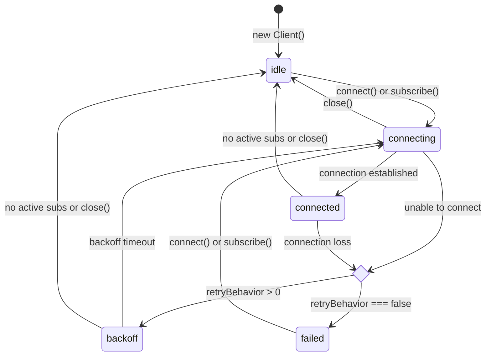

# aws-appsync-events

A lightweight client for [AWS AppSync Events](https://docs.aws.amazon.com/appsync/latest/eventapi/event-api-welcome.html).

## Highlights

- Zero deps
- [Exponential jittered backoff](https://aws.amazon.com/blogs/architecture/exponential-backoff-and-jitter/) for WebSocket connection
- 10x smaller bundle size than `aws-amplify` (~3kB gzipped)
- Built on modern Web APIs: `fetch`, `crypto`, `WebSocket`

## Why this library was built

The official AWS docs suggests using the [`aws-amplify`](https://www.npmjs.com/package/aws-amplify) library.
However, it comes with a [**30MB+ install size**](https://packagephobia.com/result?p=aws-amplify) and [**100+ dependencies**](https://npmgraph.js.org/?q=aws-amplify).
It's too bloated for apps that use it only for AppSync Events.

## Compatibility

This library works in the following environments:

- Most browsers released since 2017
- Node.js 22 and newer
- Deno 1.4 and newer
- Bun (after [issue #19785](https://github.com/oven-sh/bun/issues/19785) is fixed)

## Usage

### TL;DR

```javascript
import { apiKeyAuthorizer, Client } from 'aws-appsync-events'

const client = new Client(
  'example123.appsync-api.eu-central-1.amazonaws.com',
  apiKeyAuthorizer('da2-example123'),
)

const sub = client.subscribe('test/room-1', {
  event: e => console.log('event', e),
  error: e => console.log('error', e),
  established: () => console.log('established'),
})

// publish a couple of messages after 5 seconds
setTimeout(
  () =>
    client.publish('test/*', [
      { hello: 'from aws-appsync-events' },
      'another message',
    ]),
  5_000,
)

// later, when you want to stop listening
setTimeout(() => {
  console.log('unsubscribing...')
  sub.unsubscribe()
}, 10_000)
```

### API

#### `new Client(endpoint, connectionAuthorizer, options?)`

Creates a new AppSync Events client.

- **endpoint**

  Type: `string`

  The AppSync Events endpoint domain or URL.

  The client automatically normalizes this value, so you can pass either the HTTP or real-time variant, with or without protocol/path.

  Normalization:
  - Protocols (`http://`, `https://`, `ws://`, `wss://`) are removed.
  - Path suffixes like `/event`, `/realtime`, or `/event/realtime` are stripped.
  - Both `*.appsync-api.*` and `*.appsync-realtime-api.*` are recognized

- **connectionAuthorizer**

  Type: [`Authorizer`](#authorizer)

  Used when establishing the WebSocket connection.

- **options**

  Type: `ClientOpts` _(optional)_
  - `retryBehavior?: (attempt: number) => number | false` - Determines the delay between retry attempts.

    It returns the delay in milliseconds before the next retry attempt, or `false` to stop retrying and treat the connection as failed.

    Defaults to [exponential backoff with jitter](https://aws.amazon.com/blogs/architecture/exponential-backoff-and-jitter/) up to 3 attempts.

    Example retry behavior that waits 1.5s after each attempt and allows up to 3 attempts.

    ```javascript
    new Client(endpoint, authorizer, {
      retryBehavior: attempt => attempt <= 3 && 1500,
    })
    ```

  - `onStateChanged?: (newState: ClientState) => void` - Callback invoked whenever the client's connection state changes.

    `ClientState` is `'idle' | 'connecting' | 'connected' | 'backoff' | 'failed'`.
    See [client state diagram](#client-state-diagram).

  - `idleConnectionKeepAliveTimeMs?: number | false` - The duration (in milliseconds) to keep the underlying WebSocket connection alive when there are no active subscriptions.

    If a new subscription is started within this time, the existing connection will be reused.
    Otherwise, once the duration has elapsed, the connection will be closed.

    Set to `false` to disable idle keep-alive entirely, meaning the connection will be closed immediately when the last subscription ends.

    Defaults to `5000` (5 seconds).

  - `defaultSubscribeAuthorizer?: Authorizer` - The default [authorizer](#authorizer) for `subscribe` requests.

    If no specific authorizer is provided for a `subscribe()` call, this default authorizer will be used.

    By default, this is set to client's `connectionAuthorizer`.

  - `defaultPublishAuthorizer?: Authorizer` - The default [authorizer](#authorizer) for `publish` requests.

    If no specific authorizer is provided for a `publish()` call, this default authorizer will be used.

    By default, this is set to client's `connectionAuthorizer`.

#### `client.subscribe(channel, options)`

Start a realtime subscription on a channel.

Returns: `{ unsubscribe: () => void }`

- **channel**

  Type: `string`

  Channel name.

- **options**

  Type: `SubscribeOpts`
  - `event: (event: unknown) => void` - Called when a new event is received from the subscription.

  - `error?: (err: Error) => void` - Called when the subscription fails. This is invoked only once, since invalid subscriptions are not retried.

  - `established?: () => void` - Called when the subscription has been successfully established. May be invoked multiple times, if the underlying connection is re-established after a retry.

  - `authorizer?: Authorizer` - The [authorizer](#authorizer) to use when subscribing.

    By default, client's `defaultSubscribeAuthorizer` will be used.

```javascript
const sub = client.subscribe('orders/new', {
  event: e => console.log('event', e),
  error: e => console.log('error', e),
  established: () => console.log('established'),
})

// later
sub.unsubscribe()
```

#### `client.publish(channel, events, options?)`

Publishes a list of events to the specified channel.

Returns a promise that resolves when all event batches have been published.

- **channel**

  Type: `string`

  The channel name where the events will be published.

- **events**

  Type: `unknown[]`

  An array of events to publish.
  - Up to **5 events** can be processed per request.
  - If more than 5 events are provided, they are automatically split into batches of up to 5 events each.

- **options**

  Type: `PublishOpts`
  - `authorizer?: Authorizer` - The authorizer to use when publishing.

    By default, client's `defaultPublishAuthorizer` will be used.

```javascript
await client.publish('orders/new', [
  { id: 1, status: 'created' },
  { id: 2, status: 'created' },
])
```

#### `client.connect()`

Force the WebSocket connection to be established immediately.

Normally you don't need this - calling `subscribe()` will connect automatically.

#### `client.close()`

Closes the underlying WebSocket and cancels retries.

Future `subscribe()` calls will reconnect.

#### Authorizer

Function that generate auth headers for **connect**, **subscribe**, or **publish** operations.

See [AWS Docs](https://docs.aws.amazon.com/appsync/latest/eventapi/configure-event-api-auth.html) for more details.

All authorizers implement:

```ts
type Authorizer = (
  opts: AuthorizerOpts,
) => Promise<Record<string, string>> | Record<string, string>
```

Available helpers:

- `apiKeyAuthorizer(apiKey: string)`
- `cognitoUserPoolsAuthorizer(jwtIdToken: string)`
- `openIdConnectAuthorizer(jwtIdToken: string)`
- `lambdaAuthorizer(authorizationToken: string)`
- `awsIamAuthorizer({ accessKeyId, secretAccessKey, region, sessionToken? })`

Example:

```ts
// With API key
const client = new Client(endpoint, apiKeyAuthorizer('da2-myapikey'))

// With AWS Lambda execution role
const client = new Client(
  endpoint,
  awsIamAuthorizer({
    accessKeyId: process.env.AWS_ACCESS_KEY_ID!,
    secretAccessKey: process.env.AWS_SECRET_ACCESS_KEY!,
    sessionToken: process.env.AWS_SESSION_TOKEN!,
    region: process.env.AWS_REGION!,
  }),
)
```

### Client state diagram



## Local Development

Requirements:

- Node.js v24+
- pnpm
- Terraform with AWS provider module >= 6.9.0 available in your `$PATH`

If you're using Nix package manager, you can enter the development shell with:

```shell
NIXPKGS_ALLOW_UNFREE=1 nix develop --impure .
```

To deploy infrastructure required for e2e tests, run:

```shell
terraform init
terraform apply

# Put required environment variables to .env
terraform output -json | jq 'to_entries[] | (("vite_appsync_" +  .key) | ascii_upcase) + "=" + .value.value' -r > .env

# Don't forget to clean up resources after you finish testing
terraform destroy
```

Now you can run the tests:

```shell
# Run all unit tests
pnpm run test

# Run all end-to-end tests
pnpm run test:e2e
```

## License

[MIT](./LICENSE)
